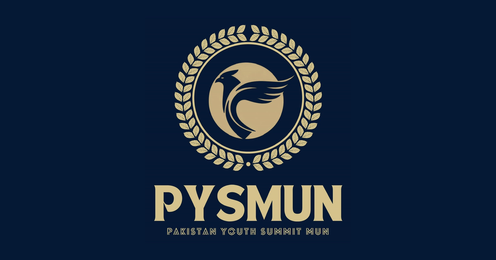

<p align="center">
  
</p>

<h1 align="center">PYSMUN</h1>

<p align="center">
  The official web experience for <strong>Pakistan Youth Summit Model United Nations</strong>.<br/>
  Inspiring Leaders, Empowering Change.
</p>

<p align="center">
  <a href="https://pysmun.com"></a>
</p>

<p align="center">
  
  
  
  
  
  
</p>

---

## Overview

A complete, launch-ready platform for a national youth MUN: an editorial marketing site, two live application programs with payment collection, applicant status tracking, and a full review console for organizers.

| Surface | What it does |
|---|---|
| Marketing site | Home, About, Executive Council, Committees, PYS Bootcamp, FAQ, Contact, Terms, Privacy |
| Applications | Multi-step "dossier" forms for the PYS Bootcamp (paid) and Campus Ambassador (free) programs |
| Status tracking | Applicants look up their Application ID and see a live review/payment timeline |
| Admin console | Supabase-Auth-gated review dashboard: search, filters, staged saves, CSV export, duplicate detection |

## Highlights

- **Editorial design system** in a single stylesheet: serif display type, a fixed navy/ivory/gold palette, and the signature arrow that straightens on hover.
- **Interactive 3D lettering** on the hero and section headers, built with Three.js and cannon-es physics. Letters can be dragged, flung, and collide inside per-page walls.
- **Serious form engineering**: Pakistani phone normalization with a fixed +92 dial chip, CNIC formatting, browser-side image optimization to WebP before upload, double-submit guards, scroll-to-error with focus, and a review ledger with a fullscreen lightbox.
- **Pay-with-application flow**: fee slip with copyable account number and IBAN, transaction reference capture, and receipt upload, verified by organizers within 24 hours.
- **Layered anti-abuse**: Cloudflare Turnstile, per-IP rate limiting, a honeypot field, three-way duplicate rejection (email, CNIC, WhatsApp number) enforced at both the API and unique-index level, and magic-byte image validation.
- **SEO done properly**: Organization, FAQPage, and Event JSON-LD, canonical URLs, per-page metadata, sitemap, robots, and security headers.

## Tech stack

- [Next.js 16](https://nextjs.org) App Router with React 19 and TypeScript
- [Supabase](https://supabase.com) for Postgres, private file storage, and admin authentication with row-level security
- [Zod](https://zod.dev) schemas as the single server-side validation source of truth
- [Three.js](https://threejs.org) + [cannon-es](https://github.com/pmndrs/cannon-es) for the physics-driven 3D lettering
- [Cloudflare Turnstile](https://developers.cloudflare.com/turnstile/) for bot protection

## Getting started

```bash
npm install
npm run dev
```

Then open the local URL printed by Next.js (default `http://localhost:3000`).

Copy `.env.example` to `.env.local` and supply only the integrations you are enabling. Without Supabase variables, valid submissions are appended to `.data/applications.ndjson` so the full flow works locally with zero setup.

## Quality checks

```bash
npm run lint
npm run typecheck
npm run build
```

## Architecture notes

**Application storage.** Applications post to `/api/applications/pys-bootcamp` and `/api/applications/campus-ambassador`; status lookups use `/api/applications/status`. With `SUPABASE_URL` and `SUPABASE_SERVICE_ROLE_KEY` set, the server writes through a service-role REST integration (never exposed to the browser). Apply the SQL files in `supabase/migrations/` in order before enabling persistence.

**Bot protection.** Set both `NEXT_PUBLIC_TURNSTILE_SITE_KEY` and `TURNSTILE_SECRET_KEY` to enable Turnstile. Server-side verification is enforced whenever the secret is configured.

**Content configuration.** Shared organization, committee, FAQ, and opportunity data lives in `lib/content.ts`, and event facts (dates, city, fee, deadline, ages) come from the single `bootcampFacts` source there. Business facts are never hardcoded in page copy.

```
app/            Routes, API handlers, metadata, sitemap, robots
components/     Form kit, admin console, 3D letter fields, site chrome
lib/            Content source of truth, Zod schemas, storage, validation
supabase/       Numbered SQL migrations (001-007)
public/         Static assets
```

---

<p align="center">
  Designed and built by <a href="https://github.com/BrAtUkA">BrAtUkA</a>
</p>

<br/>
<p align="center">
  <a href="https://github.com/BrAtUkA">
    <picture>
      <source media="(prefers-color-scheme: dark)" srcset="https://raw.githubusercontent.com/BrAtUkA/BrAtUkA/main/imgs/logo-flat-white.png">
      <source media="(prefers-color-scheme: light)" srcset="https://raw.githubusercontent.com/BrAtUkA/BrAtUkA/main/imgs/logo-flat-black.png">
      
    </picture>
  </a>
</p>
